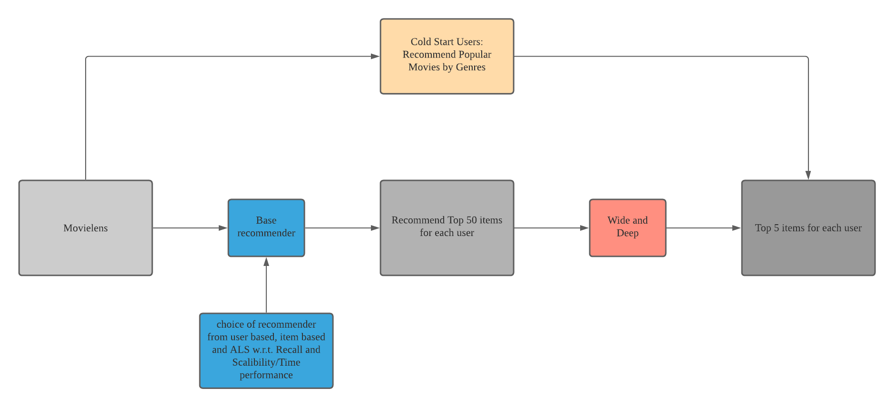

# IEOR 4571 Final Project

This repository contains an experiment design of Recommender System on Movielens Dataset.

[Final Report](./notebook/final_report.ipynb)

----

## Recommender Pipeline




## Description of Content

``` bash
├── LICENSE
├── README.md
├── data
│   ├── model_results.tar.gz #model evaluation results
│   ├── movies.csv #reference for genre information
│   └── sample.tar.gz #the sample and sample train/test
├── dockerfile #docker env when we use clusters
├── notebook #final report directory
│   └── final_report.ipynb
├── requirements.txt #required libraries
└── trained_model #trained torch model for wide and deep
```

----

## Prerequisite and Getting Started

To get start the project, you need to set up an environment first. `requirents.txt` file contains all the required packages for the environment. In addition, we also require `JDK8/11` and `Python=3.8.5`

For simplicity, you can set up a python virtual environment with `conda` by following lines:

```bash
conda create --name personalization python=3.8.5
conda activate personalization
pip install -r requirements.txt
python -m ipykernel install --user --name personalization
conda deactivate
```

Then, you will see a named `personalization` kernel in your jupyter notebook environment.

----

## Model and Recommender System

- ALS via Pyspark
- memory-based Collaborative  Filtering
- Wide and Deep via Pytorch

----

## Contribution

- Hu, Bo (UNI: bh2569)
- Qin, Rui (UNI: rq217)
- Yuan, Shuibenyang (UNI: sy2938)